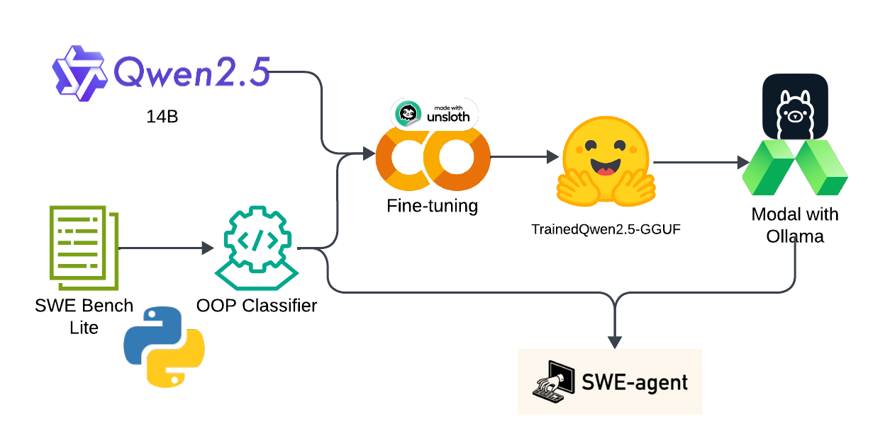

# 🧠 SWE-Agent: Lambda - 0

## Overview

This project is an intelligent agent built upon the [SWE-agent](https://github.com/princeton-nlp/SWE-agent) architecture. Its purpose is to **automatically detect and correct Python code issues** while enforcing coding standards, particularly **PEP 8**.

At its core, the agent leverages a **fine-tuned AI model** retrained using data selected via a **compiler-style classifier**. This enables it to deeply understand Python code context—especially **Object-Oriented Programming (OOP)** constructs—and apply precise, standards-aligned corrections.

---

## Features

- 🧠 **AI-based Code Understanding**: Understands code structure and semantics via fine-tuned language models.
- 🛠️ **Automatic Bug Fixing**: Suggests and applies patches to issues in Python codebases.
- 📏 **PEP 8 Compliance**: Enforces Python coding standards automatically.
- 🧪 **OOP Classifier**: A compiler-style classifier filters and selects relevant OOP examples from the SweBench-lite dataset.
- 🔄 **Retraining Pipeline**: Custom training pipeline using filtered data to enhance model performance.

---

